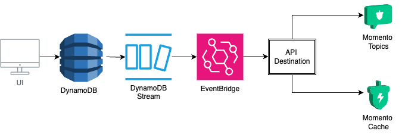

[](https://github.com/momentohq/standards-and-practices/blob/main/docs/momento-on-github.md)
[](https://github.com/momentohq/standards-and-practices/blob/main/docs/momento-on-github.md)


# Welcome to Momento <-> Eventbridge Integration Example Project

The project demonstrates a write-through cache pattern for DynamoDB using DynamoDB Streams, AWS EventBridge and Momento.
The app can be used to create, update and delete items in a DynamoDB table and the changes will be reflected in the cache/topic in real-time.

## **How's the Weather?**

Our demo app stores Weather information for different geographic locations in a DynamoDB table. Whenever the weather
for a given location is updated, an event is sent to EventBridge by DynamoDB Streams. The EventBridge rule forwards the event
to both a Momento Topic (simulating real-time notifications) and to a Momento Cache (so that subsequent requests can read
the data directly from the cache, to reduce load on the database and improve performance).

## **High-Level Architecture**



## **Prerequisites:**

- Momento Cache: You will need a cache named `momento-eventbridge-cache`. You can create one using the [momento console](https://console.gomomento.com/).
- Momento API Key: This can also be created using [momento console](https://console.gomomento.com/). Make sure the API Key is created in the same region as the cache!
- HTTP API endpoint: You can copy this from the Momento console after creating the API Key, or refer to the [Regions Section here in the documentation](https://docs.momentohq.com/platform/regions).
- AWS Credentials: `AccessKeyId`, `SecretAccessKey` for your AWS account (and, optional, `SessionToken` if you are using temporary credentials).

## **Configuration**

Create a `.env` file in the root directory of the project with the following environment variables:

```bash
MOMENTO_API_KEY=<your-momento-api-key>
MOMENTO_API_ENDPOINT=<your-momento-api-endpoint>
AWS_ACCESS_KEY_ID=<your-aws-access-key-id>
AWS_SECRET_ACCESS_KEY=<your-aws-secret-access-key>
AWS_REGION=<your-aws-region>
AWS_SESSION_TOKEN=<your-aws-session-token> # Optional, if you are using temporary credentials
```

## **Deploying the CDK Application:**

The `infrastructure` dir contains a CDK application which defines the DynamoDB table, DynamoDB Stream, and EventBridge resources.
All of the other demo code in this project relies on these resources, so you'll need to deploy the CDK stack before running
any of the code.

To deploy the CDK stack, run the following script:

```bash
./deploy-stack.sh
```

## **Running the Demo Code**

This project includes three different demos that you can use to interact with the DynamoDB and Momento resources:

- **Browser demo**: the `webapp` directory contains a simple web application with forms you can use to write weather records
  to Dynamo, and see the changes reflected in the cache and topic. It uses the Momento Web SDK to interact with Momento.
- **TypeScript CLI demo**: the `cliApp` directory contains a TypeScript CLI app that shows how to use the Momento NodeJS
  SDK to interact with the cache and topic and observe the EventBridge events.
- **Bash CLI demo**: the `cli` directory contains a simple bash script that shows how to use the `aws` and `momento` CLIs
  to interact with the cache and topic and observe the EventBridge events.

### **Running the Browser Demo:**

To run the web application, run the following script:

```bash
./run-webapp.sh
```

This script load the environment variables from the `.env` file and start the web application on `http://localhost:5173`.
Open a browser to that address, and you will see a web form that you can use to write weather records to Dynamo. When
DDB receives the updates, you will see the Momento topic updated, and you can use the web form to read the cache data
and see that it matches the DDB data!

### **Running the TypeScript CLI demo**

To run the TypeScript CLI demo, run the following script:

```bash
./run-typescript-cli-app.sh
```

This script loads the environment variables from the `.env` file and launches the TypeScript app. Take a look at the TypeScript
code in [./cliApp/cli-demo.ts](./cliApp/cli-demo.ts) to see how it works; it uses the AWS SDK to write weather records
to DynamoDB, and the Momento Node.js SDK to observe the EventBridge events being delivered to the Momento Topic and Cache.

### **Running the Bash CLI demo**

If you'd like to see how to observe the EventBridge interactions via bash and the `aws` and `momento` CLI tools, you
can run the bash cli script.

To run this demo you'll need:

- The [`aws` CLI tool](https://aws.amazon.com/cli/) installed and configured with your AWS credentials
- The [`momento` CLI tool](https://github.com/momentohq/momento-cli) installed and configured with your Momento API key

To run the bash CLI demo, open two terminal windows. In the first terminal, run the following command:

```bash
./subscribe-to-topic.sh
```

This will create a subscription to the Momento Topic that is configured to receive events from EventBridge. Whenever
an event comes in, you'll see it printed to the terminal.

In the second terminal, run the following command to trigger some DDB writes and illustrate that the values are written
through to the Momento cache:

```bash
./run-bash-cli-app.sh
```

----------------------------------------------------------------------------------------
For more info, visit our website at [https://gomomento.com](https://gomomento.com)!
